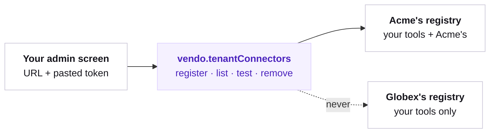

## The picture

Acme pastes an MCP URL and a token into your admin screen. From the next request, Acme's users have Acme's tools. Globex's users never see them — not because a filter hid them, but because Globex is served a different tool registry.



There is no Vendo-hosted UI here. The API is server-side, and the screen around it is yours.

## Registering

`register` is save-and-test in one call: it validates by actually connecting, and answers with the tools the server really advertised.

```ts
const result = await vendo.tenantConnectors.register({
  org: "acme",
  name: "billing",
  kind: "mcp",
  url: "https://mcp.acme.example/mcp",
  token: pastedToken,
});

if (result.status === "ok") {
  console.log(result.tools.map((tool) => tool.name)); // ["mcp_billing_lookup_invoice"]
}
```

<Warning>
  **Paste the server's Streamable HTTP URL — usually `/mcp`, never `/sse`.** The
  connector POSTs every JSON-RPC message to that one URL and reads a
  `text/event-stream` answer to that same POST. It speaks no legacy HTTP+SSE —
  there is no GET-opened stream and no second message URL — so a `/sse` endpoint
  refuses the POST and the registration comes back `unavailable`, carrying the
  server's own `MCP HTTP <status>` as its message.
</Warning>

A refusal is typed, never a thrown string:

```ts
if (result.status === "error") {
  // result.error.code — "unavailable" when the server did not answer,
  // "validation" when the registration was not usable.
  showToUser(result.error.message);
}
```

An OpenAPI tenant passes a spec instead of an MCP URL. `url` then names the API's base URL.

```ts
await vendo.tenantConnectors.register({
  org: "acme",
  name: "crm",
  kind: "openapi",
  spec: pastedYaml,
  url: "https://api.acme.example",
  token: pastedToken,
});
```

## How you wire it

The screen is yours and so is the route behind it. Vendo supplies the registration API and nothing else — who may administer an org is a question your own auth answers.

Start with a form that has no `org` field, because the org is not the browser's to name:

```tsx app/settings/connectors/page.tsx
export default function AddConnector() {
  return (
    <form action="/api/tenant-connectors" method="post">
      <input name="name" placeholder="billing" required />
      <select name="kind">
        <option value="mcp">MCP server</option>
        <option value="openapi">OpenAPI spec</option>
      </select>
      <input name="url" placeholder="https://mcp.acme.example/mcp" />
      <textarea name="spec" placeholder="Paste an OpenAPI document" />
      <input name="token" type="password" placeholder="Paste the token" />
      <button type="submit">Add</button>
    </form>
  );
}
```

The route behind it does three things, in this order: authorize the caller with your own auth, read the org off the session, then register.

```ts app/api/tenant-connectors/route.ts
import { auth } from "@/auth";
import { vendo } from "@/vendo";

export async function POST(request: Request) {
  // Your auth, not ours: Vendo never decides who may administer an org.
  const session = await auth();
  if (!session?.user.orgAdmin) return new Response("forbidden", { status: 403 });

  // The org is a fact about the session.
  const org = session.user.orgId;

  const form = await request.formData();
  const url = form.get("url");
  const spec = form.get("spec");
  const token = form.get("token");

  const result = await vendo.tenantConnectors.register({
    org,
    name: String(form.get("name")),
    kind: form.get("kind") === "openapi" ? "openapi" : "mcp",
    ...(url ? { url: String(url) } : {}),
    ...(spec ? { spec: String(spec) } : {}),
    ...(token ? { token: String(token) } : {}),
  });

  if (result.status === "error") {
    return Response.json({ code: result.error.code, message: result.error.message }, { status: 400 });
  }
  return Response.json({ tools: result.tools.map((tool) => tool.name) });
}
```

Render both branches. A refusal is the other half of this API: the org pasted a URL that does not answer, or a spec that is not usable, and the admin who pasted it is the only person who can fix either.

<Warning>
  **Take `org` from the session, never from the request body.** A body field any
  signed-in user can set lets that user register a connector against an org they
  do not belong to — the token they paste is then vaulted under that org and
  handed to its members on their next request.
</Warning>

Nothing binds until your deployment asserts memberships: a registration reaches only a request whose `memberships` seam names the org that owns it.

```ts app/api/vendo/[...vendo]/route.ts
import { createVendo } from "@vendoai/vendo/server";
import { authJs } from "@vendoai/vendo/auth/auth-js";

export const vendo = createVendo({
  auth: authJs({
    memberships: async ({ subject }) => {
      const rows = await db.membership.findMany({ where: { userId: subject } });
      return rows.map((row) => ({ org: row.orgId }));
    },
  }),
});
```

See [Orgs & memberships](/users-orgs/orgs-and-memberships) for the rest of that seam.

## Who sees what

Visibility follows the orgs your host asserts for the request — the same `memberships` seam the rest of Vendo reads. A run that asserts `acme` is served a registry carrying your tools plus Acme's; a run that asserts nothing is served the shared registry, unchanged.

The isolation is structural. Another tenant's connector is not withheld from that registry, it was never in it — so there is no filter that can be got wrong, and no listing that can leak a name.

<Note>
  Without a memberships seam no request can name an org, so nothing here can ever
  bind. The boot block says so: the `tenants` row appears only once the seam is wired.
</Note>

## The token

The pasted token is vaulted in your store's encrypted secrets under a tenant-scoped name, and it is never readable back on any surface. `list` answers metadata only.

```ts
await vendo.tenantConnectors.list("acme");
// [{ org: "acme", name: "billing", kind: "mcp", url: "…", registeredAt: "…" }]
```

The vault belongs to whichever store composes. If Vendo composes it, `VENDO_STORE_ENCRYPTION_KEY` (base64, 32 bytes) is what turns it on. If you pass your own store, you configure it there yourself — `createStore({ url, encryption: { key: ... } })` — because an explicitly passed store owns its own secrets config, and the environment variable never reaches it.

With no key at all, what happens next depends on which store composed, and the two answers differ.

| No key, and the store is… | A registration carrying a token |
| --- | --- |
| composed by Vendo, in development | Written **in the clear**, behind one loud warning |
| composed by Vendo, with `NODE_ENV=production` | Refused |
| passed by you | Refused in **every** environment, development included |

A store Vendo composes gets the development allowance automatically. A store you pass does not: it owns its own secrets config, so it refuses until you give it a key — or opt in explicitly with `createStore({ url, allowUnencryptedSecrets: true })`, which is a development convenience and nothing more.

A tokenless registration is unaffected either way: it stores no secret, so it needs no vault.

## Checking and removing

`test` re-runs the same live handshake `register` did, which is what an admin screen's status dot should call.

```ts
const status = await vendo.tenantConnectors.test("acme", "billing");
```

`remove` drops the registration and its vaulted token, and the tools are gone from the next request onward.

```ts
await vendo.tenantConnectors.remove("acme", "billing");
```

Registrations are stamped with the org that owns them, so erasing that org through the [store's erase API](/production/persistence) takes them with it.

## What this is not

<Columns cols={2}>
  <Card title="Not per-user credentials">
    One token per tenant, shared by that tenant's users. For a credential per
    person, use [connected accounts](/capabilities/connected-accounts).
  </Card>
  <Card title="Not an OAuth flow">
    A pasted token, not a consent screen against the tenant's server.
  </Card>
</Columns>
